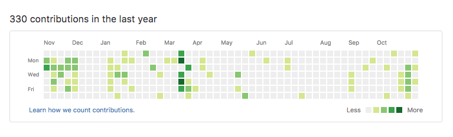
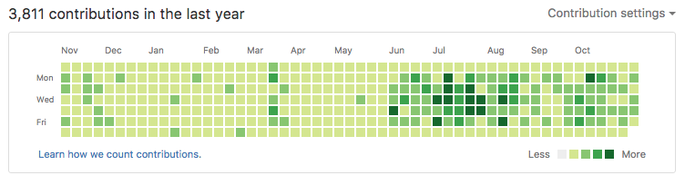

# Greybeard
Make yourself a Greybeard programmer in 2 minutes or less!

Shoutout to [avinassh](https://github.com/avinassh) and his Python project [rockstar](https://github.com/avinassh/rockstar) for the inspiration

## Installation

    $ npm install -g greybeard

or

    $ yarn global add greybeard

## Usage

Create a new folder and run:

    $ greybeard run javascript

Then sit back and it will work its magic. 

Other supported languages include: php, perl, fortran, python, asp.net, lua, f#, html, go, java, c++, c

If your language is not listed, use the file extension you'd like:

    $ greybeard run clj

## Options

  Days - Specify the number of days you want to go back in your commit history (default: 400)

    $ greybeard run javascript --days 600

  No Weekends - Normal number of commits but will exclude weekends

    $ greybeard run javascript --noweekends
 
  Random - Normal number of commits, but will have a 50/50 chance on day

    $ greybeard run javascript --random

  Even - Skips all odd number days

    $ greybeard run javascript --even

  Odd - Skips all even number days

    $ greybeard run javascript --odd

## See the results

#### Before greybeard

#### After Greybeard

## License

MIT
